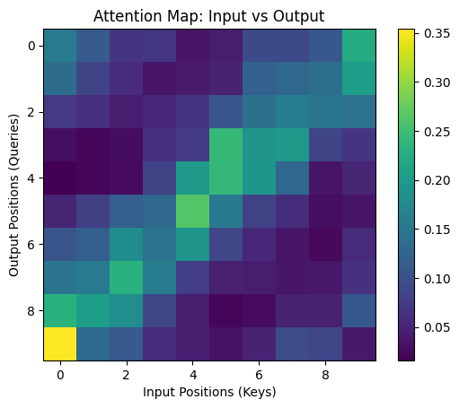

# Sequence Reverser Transformer



## Overview

The project implements a Transformer-based Encoder to reverse sequences of 10 integers.
Utilises FastAPI for deployment and PyTorch for training.

## Architecture

Transformer Encoder for seq2seq mapping.
Task is non-generative; no need for decoder.

- **Embedding**
- **Positional Encoding**
- **Encoder Blocks (4 Layers)**
  - **Multi-Head Attention (4 Heads)**
  - **Feed Forward Network**
  - **Layer Norm + Residual Connections**
- **Linear Out**

## Limitations

- Locked to `seq_len` of 10.
- Vocabulary only in range `[1, 99]`

## Run

```
fastapi dev app.py
```

## Example

Input: `[12, 45, 7, 88, 23, 56, 91, 34, 19, 72]`

Output: `[72, 19, 34, 91, 56, 23, 88, 7, 45, 12]`
