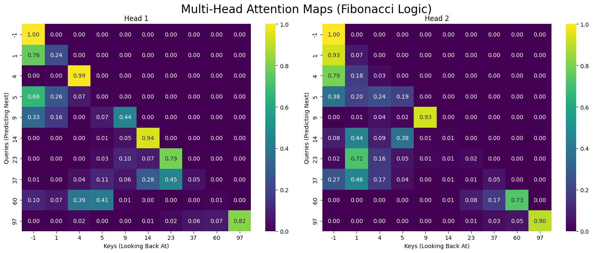

# Fibonacci Decoder Transformer

## Overview

This project trains a decoder-only transformer to predict the next Fibonacci number given a sequence of preceding values.

The model achieves **100% accuracy** on Fibonacci sequence prediction.

If you view the attention heatmap, it is not 100% looking back at n-1, n-2 positions, the model may have found a valid but redundant solution to construct the following token.

## Architecture

Transformer Decoder

- **Embedding**
- **Positional Encoding**
- **Decoder Blocks (4 Layers)**
  - **Multi-Head Attention (2 Heads)**
  - **Feed Forward Network**
  - **Layer Norm + Residual Connections**
- **Linear Out**

## Example

Seed: `[1, 4]`
Output: `[1, 4, 5, 9, 14, 23, 37, 60, 97]`
